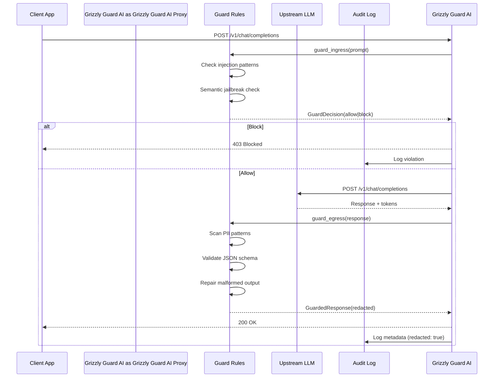

# ADR 001: Grizzly Guard AI Architecture — Functional Core + Imperative Shell for Deterministic LLM Guardrails

## Status
Accepted

## Context

Grizzly Guard AI is a deterministic firewall for LLM safety. Production LLM agents are vulnerable to:

1. **Prompt injection attacks** — Malicious users hijack agent prompts
2. **PII leakage** — Agent responses expose sensitive data (emails, SSNs, API keys)
3. **Jailbreaks** — Attackers manipulate the model into unsafe behavior
4. **Schema violations** — LLMs return malformed JSON, crashing downstream code

Traditional guardrails use another LLM to validate (800ms–2,000ms latency). Grizzly Guard AI must:

1. Block prompt injections in <5ms (deterministic)
2. Mask PII before it leaves the system
3. Repair/validate JSON schema without false rejections
4. Run locally (zero cloud dependencies)
5. Scale across multi-tenant deployments

## Decision

Adopt a **Functional Core + Imperative Shell** architecture:

- **Functional Core**: Pure guard rules (regex matching, semantic similarity, schema validation)
  - No side effects; all types frozen (Pydantic `frozen=True`)
  - Guards are first-class functions: `guard_ingress()`, `guard_egress()`, `check_jailbreak()`
  - Composable pipeline: input → [checks] → decision → output
  
- **Imperative Shell**: I/O, HTTP relay, server coordination
  - Proxy server (FastAPI) for OpenAI-compatible API
  - In-process library for direct integration
  - Config loading (YAML/JSON → dataclasses)
  - Async HTTP relay to upstream LLM (httpx)
  - Storage backends (in-memory, Redis, SQLite-Vec)

## Consequences

### Benefits
✅ **Speed**: Pure functions = <5ms ingress guard, no external calls  
✅ **Determinism**: Same prompt → same decision every time  
✅ **Composability**: Add new guard checks by extending functions  
✅ **Parallelization**: No shared state; safe for concurrent requests  
✅ **Auditability**: Complete trace of all guard decisions + matches  
✅ **No Cloud Dependency**: ONNX embeddings run locally (optional)  

### Trade-offs
⚠️ Regex-based detection has false positives/negatives vs. LLM judgement  
⚠️ Imperative shell adds complexity for HTTP coordination  
⚠️ Immutability enforced (no performance optimization via mutation)  
⚠️ Requires careful tuning of thresholds per domain  

## Architecture Diagram

### Request Flow (Ingress → Egress)

```mermaid
flowchart TD
    A[\"User Prompt\"] -->|Normalize| B{Guard Ingress}
    B -->|BLOCK| C[\"403: Blocked\"]
    B -->|ALLOW| D[\"Relay to LLM\"]
    D -->|LLM Response| E{Guard Egress}
    E -->|Redact PII| F[\"Mask Sensitive Data\"]
    F -->|Validate Schema| G{Schema Valid?}
    G -->|No| H[\"Repair JSON\"]
    H -->|Re-validate| G
    G -->|Yes| I[\"200: Guarded Response\"]
    C -->|Log Violation| J[\"Audit Log\"]
    I -->|Log Metadata| J
```

### Component Interaction Sequence



## Implementation Details

### Guard Decision Types (Functional Core)

```python
@dataclass(frozen=True)
class GuardDecision:
    status: Literal["allow", "block", "warn"]
    reason: str
    score: float  # 0.0 (safe) to 1.0 (threat)
    matched_patterns: List[str]

@dataclass(frozen=True)
class GuardedResponse:
    original: str
    redacted: str
    violations: List[str]
    repair_applied: bool
    schema_valid: bool
```

### Guard Functions (Pure)

```python
def guard_ingress(prompt: str, rules: GuardSpec) -> GuardDecision:
    \"\"\"Detect prompt injection and jailbreak attempts.\"\"\"
    # Phase 1: Fast regex patterns
    for pattern in INJECTION_PATTERNS:
        if re.search(pattern, prompt):
            return GuardDecision(status="block", score=0.95, ...)
    
    # Phase 2: Semantic similarity (optional, configurable)
    if rules.use_semantic_check:
        embedding = embedder.embed(prompt)
        max_sim = max(
            cosine_similarity(embedding, known_attack)
            for known_attack in JAILBREAK_DB
        )
        if max_sim > rules.threshold:
            return GuardDecision(status="warn" if max_sim < 0.9 else "block", ...)
    
    return GuardDecision(status="allow", score=0.0, ...)

def guard_egress(response: str, rules: GuardSpec) -> GuardedResponse:
    \"\"\"Mask PII and validate/repair schema.\"\"\"
    redacted = response
    violations = []
    
    # Redact PII
    for pii_type, pattern in rules.pii_patterns.items():
        if re.search(pattern, redacted):
            violations.append(f"Found {pii_type}")
            redacted = re.sub(pattern, f"[REDACTED {pii_type}]", redacted)
    
    # Validate + repair JSON
    repair_applied = False
    schema_valid = False
    try:
        parsed = json.loads(redacted)
        validate(parsed, rules.schema)
        schema_valid = True
    except (json.JSONDecodeError, ValidationError):
        redacted = repair_json(redacted)
        parsed = json.loads(redacted)
        validate(parsed, rules.schema)
        repair_applied = True
        schema_valid = True
    
    return GuardedResponse(
        original=response,
        redacted=redacted,
        violations=violations,
        repair_applied=repair_applied,
        schema_valid=schema_valid
    )
```

### Proxy Server (Imperative Shell)

```python
@app.post("/v1/chat/completions")
async def chat_completions(req: ChatCompletionRequest) -> ChatCompletionResponse:
    # 1. Guard ingress
    decision = guard_ingress(req.messages[-1].content, rules)
    if decision.status == "block":
        return error_response(403, decision.reason)
    
    # 2. Relay to upstream
    resp = await upstream_client.post(..., json=req.model_dump())
    
    # 3. Guard egress
    guarded = guard_egress(resp.content, rules)
    
    # 4. Log + return
    if guarded.violations:
        logger.warning(f"Violations: {guarded.violations}")
    
    return ChatCompletionResponse(
        choices=[{"message": {"content": guarded.redacted}}],
        usage=resp.usage,
        metadata={"guarded": True, "violations": len(guarded.violations)}
    )
```

## CI Integration

- **GitHub Actions**: Tests for all guard functions (regex, semantic, schema repair)
- **Performance**: Latency benchmarks ensure <5ms ingress overhead
- **Coverage**: 80%+ test coverage for all guard paths
- **False Positive Rate**: Track & report on real workloads

## Related Decisions

- ADR-002: Extensible guard check system (pluggable rules)
- ADR-003: YAML/JSON configuration for rules + thresholds
- ADR-004: Audit logging for compliance + debugging

## References

- [ARCHITECTURE.md](../docs/ARCHITECTURE.md)
- [SECURITY.md](../SECURITY.md) — Limitations & best practices
- [CONTRIBUTING.md](../CONTRIBUTING.md) — Adding new guards
