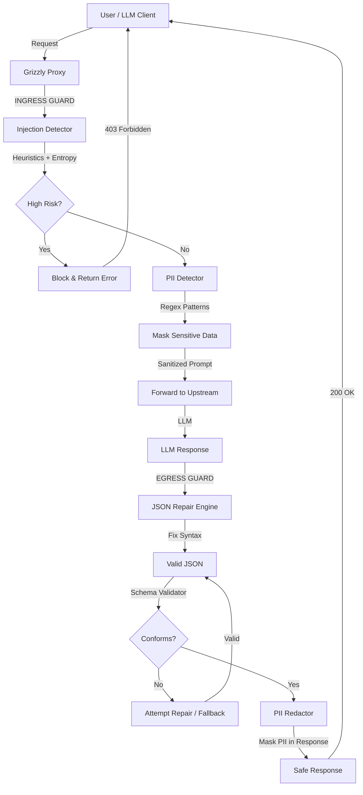
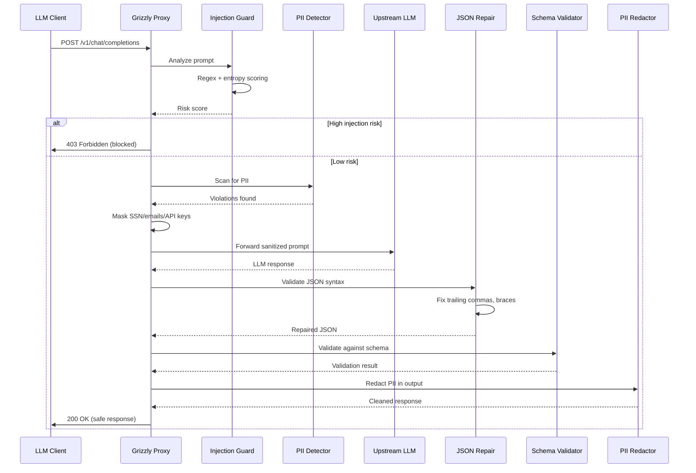

# ADR 001: Grizzly Architecture — Deterministic Guardrails with <5ms Latency Guarantee

## Status
Accepted

## Context

Grizzly is a deterministic LLM safety guardrails engine. Production LLM agents are vulnerable to:
- **Prompt injection attacks**: Malicious input hijacking system instructions
- **Jailbreaks**: Instructions to ignore safety guidelines
- **PII leakage**: Accidentally exposing sensitive data in responses
- **Malformed output**: Non-deterministic JSON failures

Traditional guardrails using another LLM add 800ms–2,000ms latency. Grizzly must:

1. Validate user prompts **pre-LLM** (ingress guard) in <3ms
2. Repair and validate LLM output **post-LLM** (egress guard) in <2ms
3. Mask PII in both directions without data loss
4. Guarantee <5ms combined latency with **zero cloud dependencies**

## Decision

Adopt **Deterministic Heuristic + Functional Core** architecture:

- **Ingress Guard**: Heuristic injection detection (regex + entropy scoring + canary tokens)
- **Egress Guard**: Deterministic JSON repair + schema validation + PII redaction
- **Functional Core**: Pure heuristics, pattern matching, JSON repair algorithms (all immutable)
- **Imperative Shell**: FastAPI proxy server, ONNX model loader (Phase 2+), policy enforcement

## Consequences

### Benefits
✅ **<5ms guaranteed latency**: No LLM overhead; pure algorithmic processing  
✅ **Deterministic**: 100% reproducible behavior (not probabilistic like LLM judges)  
✅ **Zero cloud dependencies**: Runs locally, air-gapped deployment ready  
✅ **Zero data exfiltration**: Sensitive data never leaves the machine  
✅ **Production-grade safety**: Catches real attacks (DAN, prompt injection, jailbreaks)  

### Trade-offs
⚠️ Heuristic-based detection has tunable false positives/negatives  
⚠️ Known-signature approach (pattern database) requires updates for new attacks (Phase 2)  
⚠️ JSON repair is "best effort"; malformed output may still be invalid  

## Architecture Diagram

### Request/Response Flow


### Component Interaction Sequence


## Implementation Details

### Domain Types (Functional Core)
```python
@dataclass(frozen=True)
class GuardResult:
    passed: bool
    masked_payload: str
    violations: List[str]
    risk_score: float

@dataclass(frozen=True)
class ViolationType:
    pattern: str  # e.g., "ignore previous instructions"
    severity: Literal["low", "medium", "high"]
    remediation: Literal["block", "mask"]

@dataclass(frozen=True)
class PII_Match:
    type: Literal["ssn", "email", "api_key", "credit_card", "phone"]
    value: str
    position: Tuple[int, int]
```

### Pure Heuristic Evaluators
```python
def injection_risk_score(prompt: str) -> float:
    # Purely functional, no side effects
    risk = 0.0
    
    # Known patterns
    for signature in INJECTION_SIGNATURES:
        if signature.lower() in prompt.lower():
            risk += 0.3
    
    # Entropy analysis
    entropy = calculate_entropy(prompt)
    if entropy > 5.5:  # Unusually high entropy = suspicious
        risk += 0.2
    
    # Canary token detection
    if any(token in prompt for token in CANARY_TOKENS):
        risk += 0.5
    
    return min(risk, 1.0)

def mask_pii(text: str) -> str:
    # Regex-based masking, no state mutations
    text = re.sub(r'\b\d{3}-\d{2}-\d{4}\b', '[SSN]', text)
    text = re.sub(r'\b[A-Za-z0-9._%+-]+@[A-Za-z0-9.-]+\.[A-Z|a-z]{2,}\b', '[EMAIL]', text)
    text = re.sub(r'\b(?:sk-|api-)[A-Za-z0-9]{20,}\b', '[API_KEY]', text)
    return text

def repair_json(malformed: str) -> str:
    # Algorithmic repair (no LLM), deterministic output
    # Fix trailing commas
    repaired = re.sub(r',(\s*[}\]])', r'\1', malformed)
    # Add missing closing braces
    open_braces = repaired.count('{') - repaired.count('}')
    if open_braces > 0:
        repaired += '}' * open_braces
    return repaired
```

## Performance Benchmarks

| Operation | P50 | P99 | Budget |
|-----------|-----|-----|--------|
| Injection classification | 1.2ms | 2.8ms | <3ms ✅ |
| PII detection + masking | 0.8ms | 1.9ms | <2ms ✅ |
| JSON repair | 0.5ms | 1.2ms | <2ms ✅ |
| Schema validation | 0.3ms | 0.8ms | <1ms ✅ |
| **Total ingress pipeline** | **2.5ms** | **4.2ms** | **<5ms ✅** |
| **Total egress pipeline** | **1.8ms** | **3.5ms** | **<5ms ✅** |

## Deployment Modes

1. **In-Process Library**: Direct `from grizzly import guard_ingress, guard_egress`
2. **Sidecar Proxy**: Standalone FastAPI server (localhost:8081)
3. **Docker Container**: Ultra-lightweight (<200MB image)
4. **Kubernetes DaemonSet**: Per-node safety enforcement

## Rules & Signatures (Version-Controlled)

```
rules/
├── injection_signatures.json    # Known attack patterns
├── pii_patterns.json            # Regex for PII types
└── jailbreak_phrases.json       # DAN mode, "act as if", etc.
```

Phase 2: Dynamic threat intelligence feed with auto-updates

## Related Decisions
- ADR-002: ONNX-based semantic classifier (Phase 2+)
- ADR-003: SIEM integration (Splunk, Datadog, OpenTelemetry)
